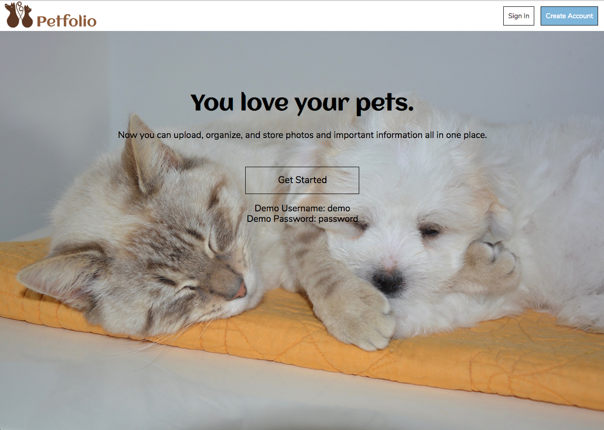
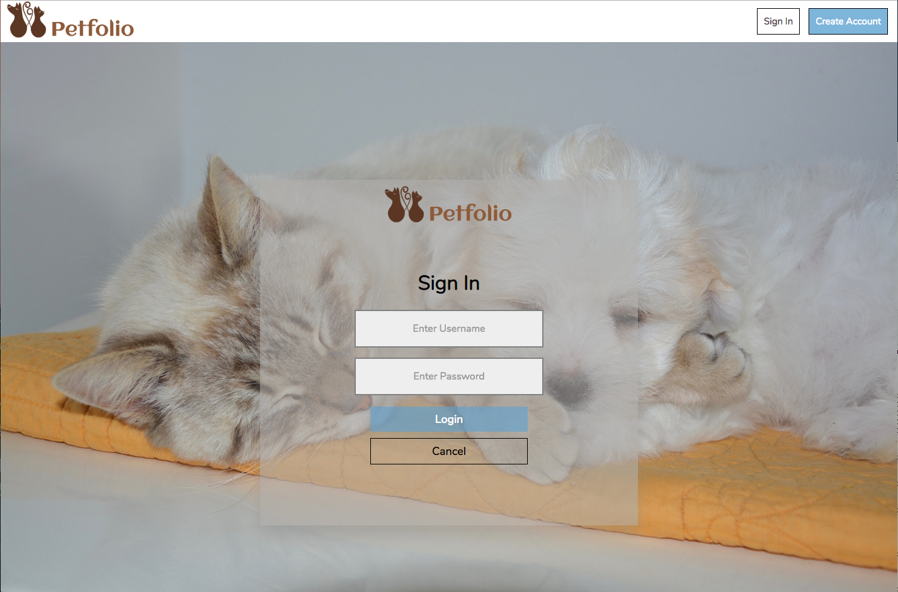
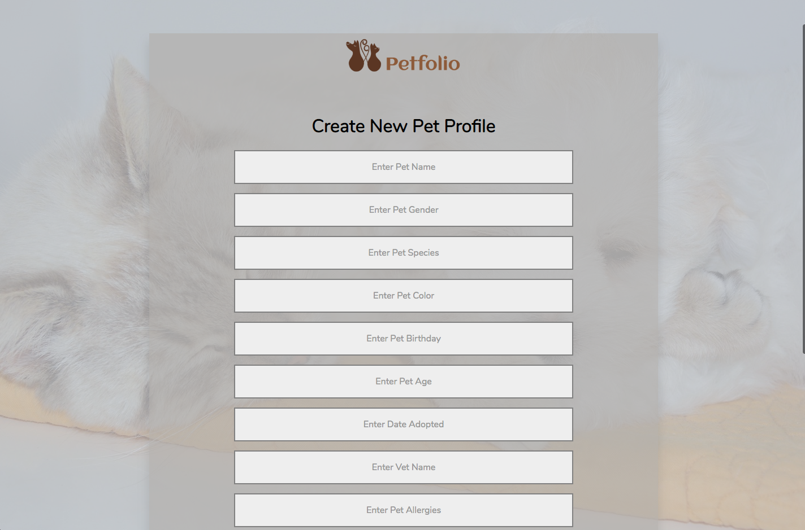
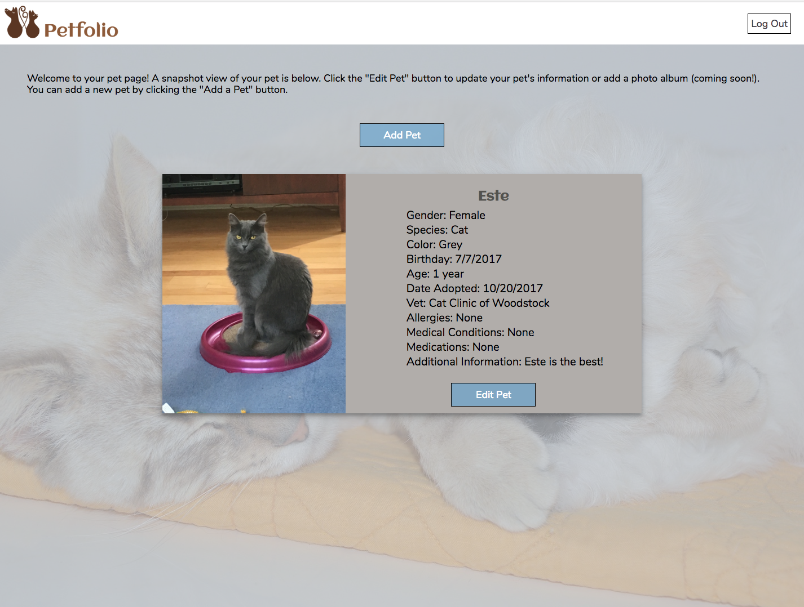
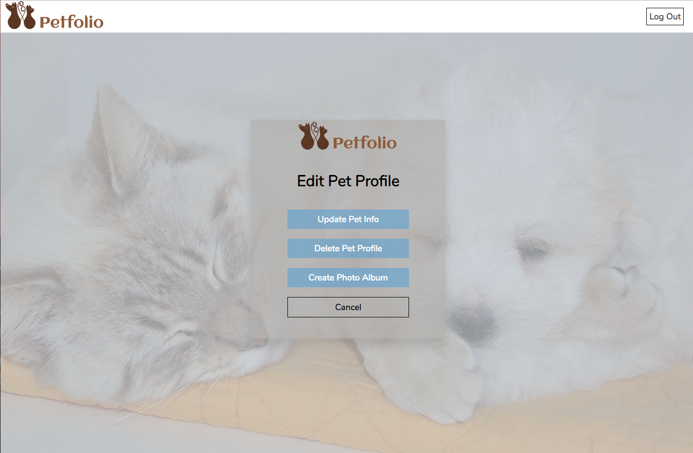

# Petfolio
An application that allows users to upload and organize information about their pets.

## Motivation
Many pet owners have hundreds of photos of their pet.  This app was created to assist pet owners in organizing their photos as well as storing important information about their pets (such as medications) so that the information can be quickly accessed.

## Demo
Live Demo: [Petfolio](https://secret-woodland-65665.herokuapp.com/)    

**Demo Account:**  
Username: demo  
Password: password

## Screenshots

## Technologies Used
Node, Express, JQuery, JavaScript, MongoDB, Mongoose, JWT, Passport, Multer, Mocha, Chai, REST APIs

## Future Enhancements
* Add slide show feature for pet profile display
* Add photo album feature
* Add ability to tag and search photos
* Add ability to share photos and albums on social media

